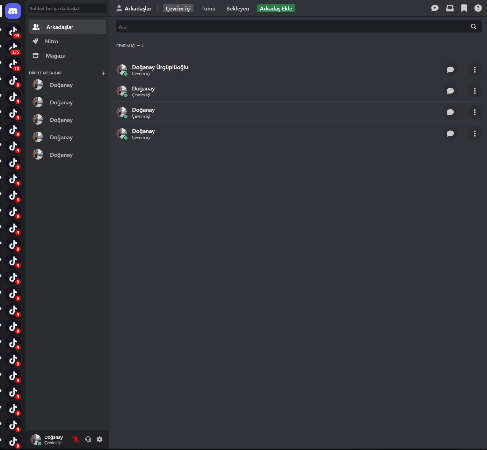

# Discord Arayüz Klonu - HTML & CSS Pratiği

Bu proje, Discord'un arayüzünü HTML ve CSS kullanarak yeniden oluşturmayı hedefleyen bir çalışma projesidir. Sadece eğitim ve pratik amaçlı olarak geliştirilmiştir.

## Proje Hakkında

Bu proje, Discord'un temel arayüz elemanlarını ve animasyonlarını HTML ve CSS kullanarak yeniden oluşturmak için yapılan bir pratik çalışmasıdır. Asıl amaç, karmaşık CSS komponentlerini anlamak ve responsive tasarım prensiplerini uygulamaktır.

## Projede Bulunan Özellikler

- Server listesi (scrollable)
- Direct Messages (DM) bölümü
- Online arkadaşlar listesi
- Kullanıcı profil sekmesi
- Hover efektleri (username değişimi, server highlight efektleri)
- Bildirim göstergeleri
- Çevrimiçi durum göstergeleri

## Teknik Detaylar

### HTML Yapısı

Proje üç ana bölümden oluşmaktadır:
1. **Servers** - Sol taraftaki sunucu listesi
2. **DMs** - Ortadaki direkt mesajlar bölümü
3. **Onlines** - Sağdaki çevrimiçi kullanıcılar bölümü

### CSS Özellikleri

- **Flexbox** - Sayfanın genel düzeni için kullanıldı
- **Position: absolute/relative** - Bildirim sayısı, çevrimiçi göstergeleri gibi öğeler için
- **CSS Transitions** - Hover efektleri için kullanıldı
- **Nested selectors** - CSS organizasyonu için
- **Pseudo-selectors** - `:hover`, `:first-child` gibi

### Özel Animasyonlar

- **Server Highlight**: Sunucu ikonlarının üzerine gelindiğinde beyaz bir gösterge beliriyor
- **Username Transition**: Kullanıcı profili üzerine gelindiğinde "Çevrim içi" yazısı yukarı kayarak yerini kullanıcı adına bırakıyor
- **Border Radius Transitions**: Yuvarlak ikonlar hover durumunda köşeli hale geliyor

## Öğrenilen Dersler

- CSS pozisyonlama teknikleri 
- Overflow ve scroll yönetimi
- Görsel göstergeler için CSS animasyonları
- Flexbox ile kompleks yapılar oluşturma
- Nested içeriklerin hover durumlarını yönetme
- İç içe geçmiş elementlerin z-index ve pozisyon yönetimi

## İleriki Geliştirmeler

- Responsive tasarım eklenebilir
- Dark/Light tema seçenekleri
- JavaScript ile interaktif özellikler
- Modal ve popup'lar
- Mesaj yazma ve gönderme animasyonları

---

> Bu proje sadece eğitim amaçlıdır ve Discord'un ticari bir kopyası olmayı amaçlamamaktadır. Tüm haklar ve tasarım Discord'a aittir.